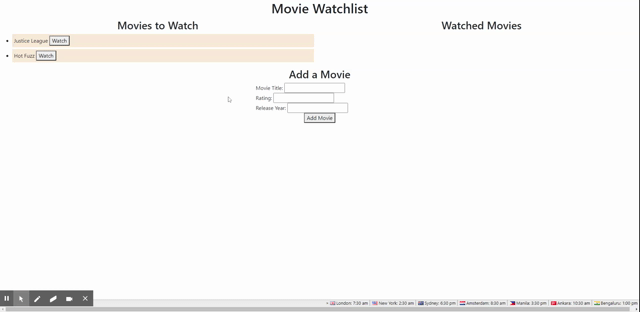

# Movie Tracker

 
## Description
 This application is a full-stack web application that allows the user to add a movie to their watchlist, move that movie to their watched movies list, and remove movies from a watched movies list. This database is global rather than local, so changes will not be temporary to a single server instance.
 ## Table of Contents
 <!--ts--> 
* [Description](#description) 
* [Demo](#demonstration)
 * [Installation](#installation) 
 * [Project Usage](#usage) 
 * [Licenses](#licenses) 
 * [Tests](#tests) 
 * [Contributing](#Contributing) 
 * [Questions](#questions)
 <!--te--> 

## Demonstration

## Installation 
 To install, ensure that you load the node package manager first. Once this has been initiated, install three key nodes: 1) Express 2) Express-Handlebars 3) MySQL. Once these have been installed, ensure that the mysql link is properly established.
 
## Usage 
 This application can be used to save a movie, to remember to watch it later. This application also allows the user to mark movies that they have added to their watchlist as having been watched, and those movies will move over to the watched movies area. Once the user no longers needs to see a movie in the watched movies area, they can delete the movie from the lists entirely.
 
## Licenses 
 This was built using code developed by: [MIT](https://opensource.org/licenses/MIT)
 
## Contributing 
 To contribute to this project: No contribution
 
## Tests 
 When running this file ensure the function is running properly by: No testing
 
## Questions 
 Send questions to Shaun Limbeek at shaun.limbeek@gmail.com, or see the github repository here: https://github.com/slimbeek6 and the live site here: https://shrouded-gorge-50038.herokuapp.com/